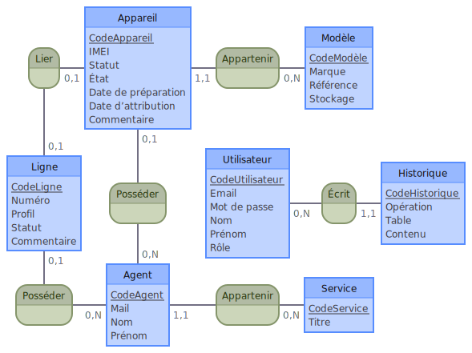

# Gestion SMAC (Back-end)

Cette application permet de gérer des périphériques mobiles (smartphones, tablettes, clés 4G).
Elle a été initialement créée pour simplifier le travail du service téléphonie mobile du Ministère de la Transition écologique et de la Cohésion des territoires.

## Front-end

A utiliser avec le front-end stocké sur le repository : <https://github.com/chrisberlant/gestion-SMAC-front>

## Structure de la base de données

### MCD (Modèle Conceptuel de Données)



### MLD (Modèle Logique de Données)

Agent(<u>CodeAgent</u>, mail, nom, prénom, #CodeService)

Service (<u>CodeService</u>, titre)

Appareil (<u>CodeAppareil</u>, imei, statut, état, dateDePréparation, dateDAttribution, commentaire, #CodeAgent, #CodeModèle, #CodeLigne)

Modèle (<u>CodeModèle</u>, marque, référence, stockage)

Ligne (<u>CodeLigne</u>, numéro, profil, statut, commentaire, #CodeAgent, #CodeAppareil)

Utilisateur (<u>CodeUtilisateur</u>, email, motDePasse, nom, prénom, rôle)

Historique(<u>CodeHistorique</u>, opération, table, contenu, #CodeUtilisateur)

### MPD (Modèle Physique de Données)


## Mise en place

### Variables d'environnement

Créez un fichier .env à la racine du projet en vous basant sur le fichier .env.example existant.

-   PORT : port utilisé par le serveur pour écouter les requêtes HTTP
-   PG_URL : adresse de votre base de données PostgreSQL
-   SALT_ROUNDS : nombre de fois que le processus de hashage sera effectué sur les mots de passe
-   SECRET_KEY : clé qui servira à déchiffrer le token envoyé par le client
-   CLIENT_URL : adresse du client qui contactera votre serveur.

### Création de la base de données

Rendez vous dans le dossier db_creation.

Pour créer la structure de la base de données :

```bash
psql -U username -d db_name -h hostname -f insert_tables.sql
```

Cette commande crée également l'utilisateur root avec les identifiants : user.root@gmail.com / Azerty123\*

Pour insérer les données fictives :

```bash
psql -U username -d db_name -h hostname -f insert_data.sql
```

## Fonctionnalités

Les fonctionnalités de l'application du point de vue d'un sont détaillées sur le repository contenant le front-end.
Ici seront uniquement détaillées les fonctionnalités gérées par le serveur.

### Middlewares

Différents middlewares assurent la sécurité de l'accès à la base de données.

#### jwtMiddleware

Gère l'authentification des utilisateurs en refusant toute requête (hors authentification) qui ne contient pas ou contient un token invalide. En cas de validation, la requête stocke l'id de l'utilisateur.

#### requestsLimitMiddleware

Empêche le client d'effectuer plus de 5 tentatives d'authentification par minute, limitant ainsi le brute force.

#### dataValidationMiddleware

Valide les données envoyées par le client en utilisant un schéma créé via Zod. Retourne un statut HTTP d'erreur en cas de données non fournies ou non valides.

#### rightsMiddleware

Gère l'accès à certaines routes en fonction d'un rôle :

-   Consultant : peut accéder en lecture uniquement, ne peut pas effectuer d'import/export de CSV
-   Tech : peut lire/modifier/supprimer des données et effectuer des imports/exports
-   Admin : peut effectuer les mêmes choses que Tech mais aussi accéder à l'historique des requêtes, accéder au tableau de bord pour gérer les utilisateurs de l'application, les modèles d'appareils et les services.

#### requestNotFoundMiddleware

Indique une requête incorrecte au client si la route fournie n'existe pas.
